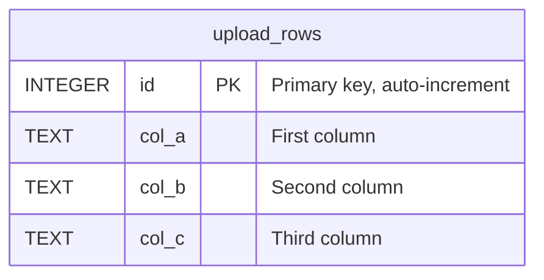
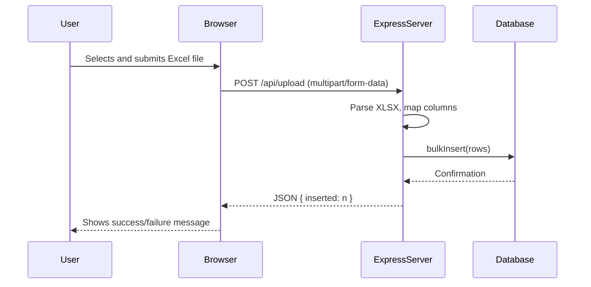
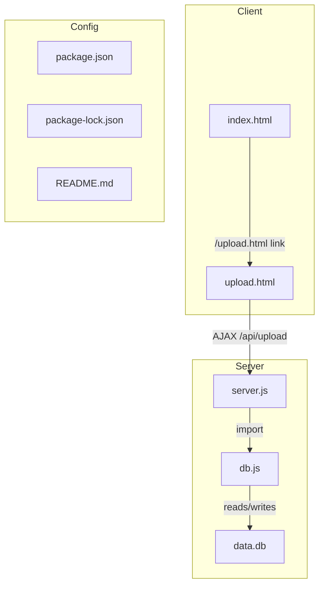

# Documentation for File Uploader Project

This documentation covers all relevant files found in your file upload project, explaining their purpose, structure, and usage. This project allows users to upload Excel files through a web interface, parses the data, and stores it in a SQLite database. The backend exposes a REST API that handles file uploads and data retrieval.

---

## `db.js`

This module manages the SQLite database, including initialization and bulk-insertion logic. It ensures that the required directory and table exist and provides an interface for inserting uploaded spreadsheet rows into the database.

### Main Features

- **Database Initialization**
  - Creates a `db` directory if not present.
  - Initializes a SQLite database named `data.db`.
- **Table Creation**
  - Ensures `upload_rows` table exists with columns: `id`, `col_a`, `col_b`, `col_c`.
- **Bulk Insert Function**
  - Efficiently inserts multiple rows from the uploaded Excel data.

### Code Breakdown

```js
import Database from 'better-sqlite3';
import { mkdirSync } from 'fs';
import { dirname, join } from 'path';
import { fileURLToPath } from 'url';

const __dirname = dirname(fileURLToPath(import.meta.url));
const dbDir = join(__dirname, 'db');
mkdirSync(dbDir, { recursive: true });

const db = new Database(join(dbDir, 'data.db'));

db.exec(`
  CREATE TABLE IF NOT EXISTS upload_rows (
    id INTEGER PRIMARY KEY AUTOINCREMENT,
    col_a TEXT,
    col_b TEXT,
    col_c TEXT
  );
`);

const insert = db.prepare('INSERT INTO upload_rows (col_a, col_b, col_c) VALUES (?, ?, ?)');

export function bulkInsert(rows) {
  const runMany = db.transaction((data) => {
    for (const r of data)
      insert.run(r.col_a, r.col_b, r.col_c);
  });
  runMany(rows);
}

export { db };
```

### Database Schema



---

## `README.md`

The `README.md` provides a concise instruction on how to run the project locally.

### Content

```md
# Upload Tech Test – Question 2

## Run locally

```bash
npm install
npm start
```
```

- **Purpose:** Briefly explains how to start the server.
- **Instructions:** 
  1. Install dependencies: `npm install`
  2. Start the server: `npm start`

---

## `package.json`

This file defines the Node.js project, its dependencies, scripts, and essential metadata.

### Key Sections

| Field         | Description                                           |
|---------------|-------------------------------------------------------|
| name          | Project name (`file_uploader`)                        |
| version       | Project version (`1.0.0`)                             |
| description   | Short description (`File Upload`)                     |
| main          | Entry file (not actually used, as server.js is main)  |
| type          | Module type (`module` for ES modules)                 |
| scripts       | Start, test, and dev commands                         |
| dependencies  | List of required dependencies                         |
| devDependencies | Nodemon for development server reloads              |

#### Dependencies

- **express** – Web framework for Node.js.
- **multer** – Middleware for handling file uploads.
- **better-sqlite3** – SQLite binding for fast database operations.
- **xlsx** – Parses and writes Excel files.
- **dotenv** – Loads environment variables from `.env`.

#### DevDependencies

- **nodemon** – Restarts the server on code changes.

### Install All Dependencies

```packagemanagers
{
    "commands": {
        "npm": "npm install",
        "yarn": "yarn install", 
        "pnpm": "pnpm install",
        "bun": "bun install"
    }
}
```

---

## `package-lock.json`

This file ensures deterministic dependency versions for builds. It records the exact dependency tree used for installation, providing reproducibility for the project.

- **Purpose:** Guarantees all developers and deployments use the same dependency versions.
- **Usage:** Managed automatically; do not edit manually.

---

## `server.js`

This is the main backend server file. It defines the Express application, sets up middleware, configures file upload handling, and implements the API endpoints.

### Key Functions

- Serves static files from the `public` directory.
- **Health check route** at `/`.
- **Excel file upload API** at `/api/upload`.
- **Data retrieval API** at `/api/rows`.
- Starts the server on the specified port (default: `4002`).

### Highlights

- Uses `multer` for file handling, storing uploads in `uploads/`.
- Reads `.xlsx` files with the `xlsx` package.
- Maps columns `A`, `B`, `C` (or `col_a`, `col_b`, `col_c`) to DB fields.
- Inserts rows into SQLite using `bulkInsert`.
- Returns the number of inserted rows as the response.
- Handles errors and returns appropriate status codes.

### API Endpoint Documentation

#### Health Check

```api
{
    "title": "Health Check",
    "description": "Returns a simple status message to verify the API is running.",
    "method": "GET",
    "baseUrl": "http://localhost:4002",
    "endpoint": "/",
    "headers": [],
    "queryParams": [],
    "pathParams": [],
    "bodyType": "none",
    "requestBody": "",
    "responses": {
        "200": {
            "description": "API is operational",
            "body": "UPLOAD-TEST API OK"
        }
    }
}
```

#### Upload Excel File

```api
{
    "title": "Upload Excel File",
    "description": "Uploads an Excel (.xlsx) file and imports its rows into the database.",
    "method": "POST",
    "baseUrl": "http://localhost:4002",
    "endpoint": "/api/upload",
    "headers": [
        {
            "key": "Content-Type",
            "value": "multipart/form-data",
            "required": true
        }
    ],
    "queryParams": [],
    "pathParams": [],
    "bodyType": "form",
    "formData": [
        {
            "key": "file",
            "value": "The .xlsx file to upload",
            "required": true
        }
    ],
    "responses": {
        "200": {
            "description": "Success - Number of rows inserted",
            "body": "{\n  \"inserted\": 42\n}"
        },
        "500": {
            "description": "Server error (e.g. invalid Excel file)",
            "body": "{\n  \"error\": \"Error message\"\n}"
        }
    }
}
```

#### List Inserted Rows

```api
{
    "title": "List Inserted Rows",
    "description": "Retrieves all rows that were uploaded and stored in the database.",
    "method": "GET",
    "baseUrl": "http://localhost:4002",
    "endpoint": "/api/rows",
    "headers": [],
    "queryParams": [],
    "pathParams": [],
    "bodyType": "none",
    "requestBody": "",
    "responses": {
        "200": {
            "description": "Returns an array of all uploaded rows",
            "body": "[\n  {\n    \"id\": 1,\n    \"col_a\": \"Value A\",\n    \"col_b\": \"Value B\",\n    \"col_c\": \"Value C\"\n  }\n]"
        }
    }
}
```

### API Flow



---

## `upload.html`

This file implements the user interface for uploading Excel files. It uses a modern, card-based design and vanilla JavaScript for handling form submissions and UI updates.

### Features

- **File Input:** Accepts `.xlsx` files only.
- **Custom File Picker UI:** Replaces default file input.
- **AJAX Upload:** Submits file via JavaScript `fetch` API.
- **Feedback:** Displays upload progress, success, or error messages.
- **Styling:** Responsive, dark-themed, with accent colors.

### Main UI Structure

| Element         | Purpose                                 |
|-----------------|-----------------------------------------|
| `.card`         | Main container for the form and status  |
| `form#upForm`   | The file upload form                    |
| `input#fileInp` | Hidden file input, accepts `.xlsx`      |
| `.file-label`   | Clickable label for file input          |
| `.btn`          | Submit button                           |
| `#log`          | Displays success/error messages         |

### Key JavaScript

- Changes label text to the selected file name.
- Handles form submission via AJAX.
- Displays number of rows inserted or error.

### Example UI Flow

```mermaid
flowchart TD
    A[User chooses Excel file] --> B{File selected?}
    B -- No --> C[Prompt: Choose file…]
    B -- Yes --> D[Show file name on label]
    D --> E[User clicks Import Data]
    E --> F[AJAX POST to /api/upload]
    F --> G{Success?}
    G -- Yes --> H[Show "Inserted X rows"]
    G -- No --> I[Show error message]
```

---

## `index.html`

This is the landing page for the project. It displays a simple card with a button to access the upload form.

### Features

- **Card Layout:** Clean, minimal UI.
- **Launch Button:** Directs user to `/upload.html`.
- **Status Message:** Confirms backend is running.

### Main Elements

| Element        | Purpose                        |
|----------------|--------------------------------|
| `.card`        | Container for all content      |
| `h1`           | Title                          |
| `p`            | Sub-title / status message     |
| `a.btn`        | Button to open upload form     |

---

## System Overview

### File/Module Relationships



---

## Summary Table

| File                 | Purpose                                                      |
|----------------------|-------------------------------------------------------------|
| `db.js`              | Database setup and bulk insert logic                        |
| `README.md`          | Quickstart instructions                                     |
| `package.json`       | Project metadata, dependencies, scripts                     |
| `package-lock.json`  | Exact dependency versions for reproducible installs         |
| `server.js`          | Main backend file, defines API and server logic             |
| `upload.html`        | User-facing form for uploading Excel files                  |
| `index.html`         | Landing/status page for the project                         |

---

## 🏁 Getting Started

To run the project locally:

1. **Install dependencies:**
    ```bash
    npm install
    ```
2. **Start the server:**
    ```bash
    npm start
    ```
3. **Visit:** [http://localhost:4002](http://localhost:4002) in your browser.

---

## 🚦 API Summary

- **GET /** — Health check
- **POST /api/upload** — Upload Excel file (multipart/form-data)
- **GET /api/rows** — Retrieve inserted rows as JSON

---

## 💡 Notes

- Only `.xlsx` files are accepted.
- Database schema is fixed: only columns A/B/C or col_a/col_b/col_c are imported.
- The UI provides clear feedback for each upload attempt.
- The backend is easily extensible for more columns or advanced validation.

---

**This documentation should help developers, testers, and users understand, extend, and operate the file uploader project efficiently.**